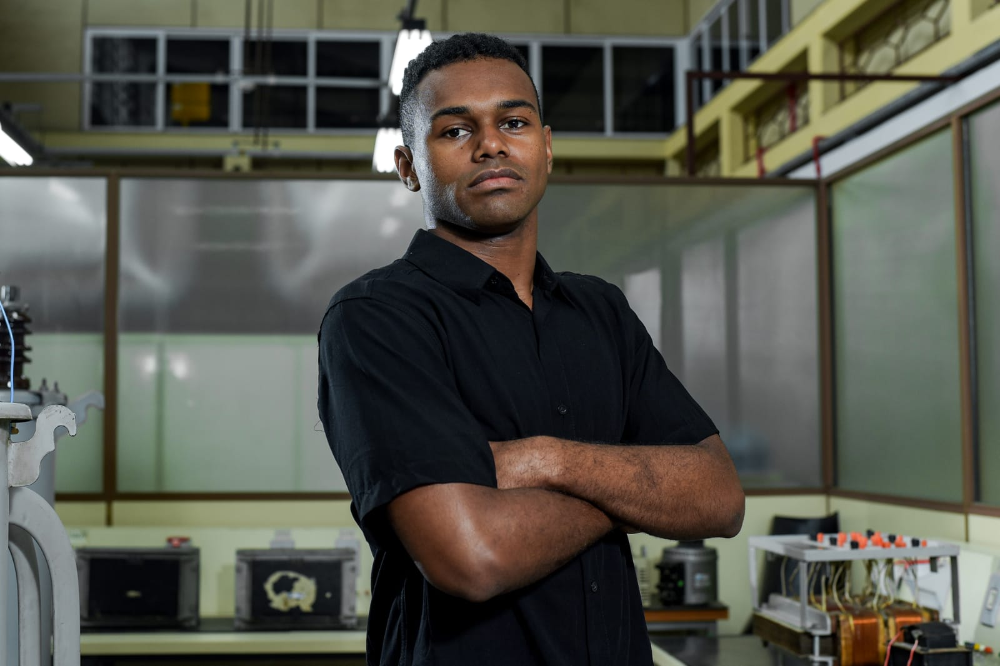

# portfolio-interface

> resultado final do meu projeto .

### Ajustes e melhorias

O projeto ainda está em desenvolvimento e as próximas atualizações serão voltadas nas seguintes tarefas:

- [x] criação REACT
- [x] criação JAVASCRIPT

Agradecemos às seguintes pessoas que contribuíram para este projeto:

<table>
  <tr>
    <td align="center">
      <a href="#">
         
        
          <b>Tiago Agostinho</b>
        
      </a>
    </td>
  </tr>
</table>
